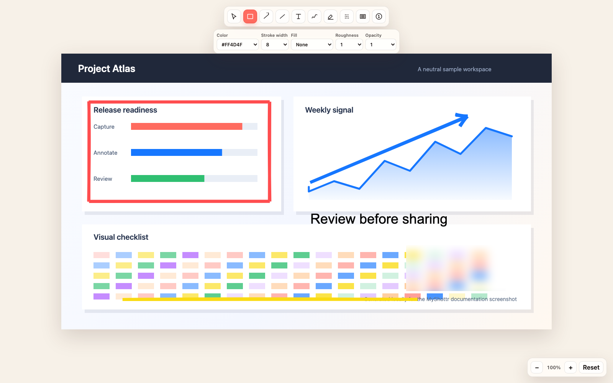

# MyShottr

Fast, local screenshot capture and Excalidraw-style annotation for macOS.



MyShottr captures a macOS region or the visible content of the active Chrome
tab, then opens it in one editable Quick Ink canvas. Captures stay on your Mac.
See the [v0.1.0 release notes](docs/releases/v0.1.0.md) for artifact details and
the current verification boundary.

## Features

- Native region capture with `Command-Shift-2`
- Clean Chrome viewport capture without tabs, address bar, or toolbars
- Rectangle, arrow, line, text, freehand, highlighter, blur, redaction, and
  numbered-marker annotations
- Move, resize, rotate, duplicate, reorder, multi-select, undo, and redo
- Copy Image, source-resolution PNG export, and editable `.myshottr` projects
- Crash recovery for unsaved documents
- No account, upload, analytics, or telemetry
- No telemetry or background capture-data network transfer

## 한국어 빠른 설치

MyShottr는 macOS 15 이상에서 동작합니다. `v0.1.0` 배포본은 unsigned 및
unnotarized 상태입니다. 실행 파일에는 macOS 실행을 위한 link-time ad-hoc
서명이 있을 수 있지만, 이는 Developer ID 서명이 아니며 Apple의 공증이나
검토를 의미하지 않습니다.

1. [최신 GitHub Release](https://github.com/gihwan-dev/MyShottr/releases/latest)에서
   `MyShottr-0.1.0-macos.zip`과 `MyShottr-Chrome-0.1.0.zip`을 내려받습니다.
2. 앱 ZIP의 압축을 풀고 `MyShottr.app`을 `/Applications`로 옮깁니다.
3. Finder에서 앱을 Control-click한 뒤 **열기**를 선택합니다. 차단되면
   **시스템 설정 → 개인정보 보호 및 보안 → 확인 없이 열기**를 사용합니다.
4. 앱을 한 번 실행합니다. 이 first launch가 현재 앱 경로의 Chrome
   Native Messaging Host를 사용자 계정에 등록합니다.
5. Chrome ZIP의 압축을 풀고 `chrome://extensions`에서 **Developer mode**를
   켠 뒤 **Load unpacked**를 선택해 `MyShottr-Chrome-0.1.0` 폴더를
   불러옵니다.
6. 네이티브 영역 캡처를 위해 **화면 기록(Screen Recording)** 권한을
   허용하고 MyShottr를 다시 실행합니다.

Control-click과 시스템 설정 경로를 먼저 사용하세요. 이를 사용할 수 없는
환경에서만, 위험을 이해한 뒤 격리 속성을 제거하는 아래 명령을 last resort로
사용할 수 있습니다. 이 명령은 정확히 `/Applications/MyShottr.app`만
대상으로 합니다.

```bash
xattr -dr com.apple.quarantine /Applications/MyShottr.app
```

## Install

MyShottr requires macOS 15 or newer. Version `v0.1.0` is unsigned and
unnotarized: it has no Developer ID distribution signature and has not been
reviewed by Apple. Its executables may contain a link-time ad-hoc signature;
that is not a Developer ID signature and does not establish notarization.

1. Download `MyShottr-0.1.0-macos.zip` and
   `MyShottr-Chrome-0.1.0.zip` from the
   [latest GitHub Release](https://github.com/gihwan-dev/MyShottr/releases/latest).
2. Extract the app archive and move `MyShottr.app` to `/Applications`.
3. In Finder, Control-click the app and choose **Open**. If Gatekeeper still
   blocks it, open **System Settings → Privacy & Security** and choose
   **Open Anyway** for MyShottr.
4. Open MyShottr once. The first launch registers its per-user Chrome
   Native Messaging Host using the app's current absolute path.
5. Extract the Chrome archive. Open `chrome://extensions`, enable
   **Developer mode**, choose **Load unpacked**, and select the extracted
   `MyShottr-Chrome-0.1.0` directory.
6. Grant **Screen Recording** for native region capture, then relaunch MyShottr.

Do not remove quarantine recursively from `/Applications` or another broad
directory. The app-scoped last-resort command is documented in the Korean
quick-start above.

## Use

- Press `Command-Shift-2` or choose **Capture Area** from the menu bar for a
  native region.
- Click the Chrome extension or press `Option-Shift-2` for the active tab's
  visible viewport.
- Press `Command-Shift-C` to copy the complete composited image.
- Press `Command-S` to save an editable `.myshottr` project.
- Press `Command-E` to export a source-resolution PNG.
- Press `Command-C` and `Command-V` to copy and paste selected annotations
  inside the editor.

## Annotation shortcuts

| Tool | Key |
| --- | --- |
| Select | `V` |
| Rectangle | `R` |
| Arrow | `A` |
| Line | `L` |
| Text | `T` |
| Freehand | `P` |
| Highlighter | `H` |
| Blur | `B` |
| Redaction | `X` |
| Number marker | `N` |

Blur is a visual effect, not secure redaction. Use Redaction when pixels must
be fully covered in the exported image.

## Privacy

Captures, projects, recovery files, inbox files, clipboard output, and exports
stay on the Mac. MyShottr has no account, cloud upload, analytics, or telemetry.
The bundled editor blocks remote navigation and network access. The Chrome
extension uses only `activeTab` and `nativeMessaging`; it has no content script,
persistent host permission, page URL storage, or alternate capture mechanism.

Run `Scripts/verify-privacy.sh` after building to check the local-only editor
bundle and exact Chrome permission contract.

## Development

Prerequisites: macOS 15+, Xcode 26+ with Swift 6, Node 22+, pnpm 10.14+, and
[XcodeGen](https://github.com/yonaskolb/XcodeGen).

```bash
pnpm install --frozen-lockfile
Scripts/verify-v1.sh
```

Generate and open the Xcode project:

```bash
xcodegen generate
open MyShottr.xcodeproj
```

Automated verification does not replace the
[manual acceptance record](docs/testing/v1-acceptance.md). A release candidate
is not manually accepted while any required item is `BLOCKED` or unverified.

## v1 limitations and roadmap

- Chrome captures the visible viewport only; full-page scrolling capture is
  planned behind the existing capture-mode boundary.
- Desktop mockup and presentation frames are planned behind the existing
  presentation layer; `v0.1.0` supports only `presentation.type = "none"`.
- HTML element capture, OCR, capture history, video, and audio are not included.
- Safari and Firefox are not supported in v1. Chromium variants other than
  Google Chrome are not guaranteed.
- Full-display, window-specific, and multi-display-spanning native capture are
  not included.
- The app has no automatic updater and is not distributed through an app store
  or the Chrome Web Store.
- Developer ID signing and Apple notarization are planned after `v0.1.0`.

## License

MyShottr is available under the [MIT License](LICENSE).
