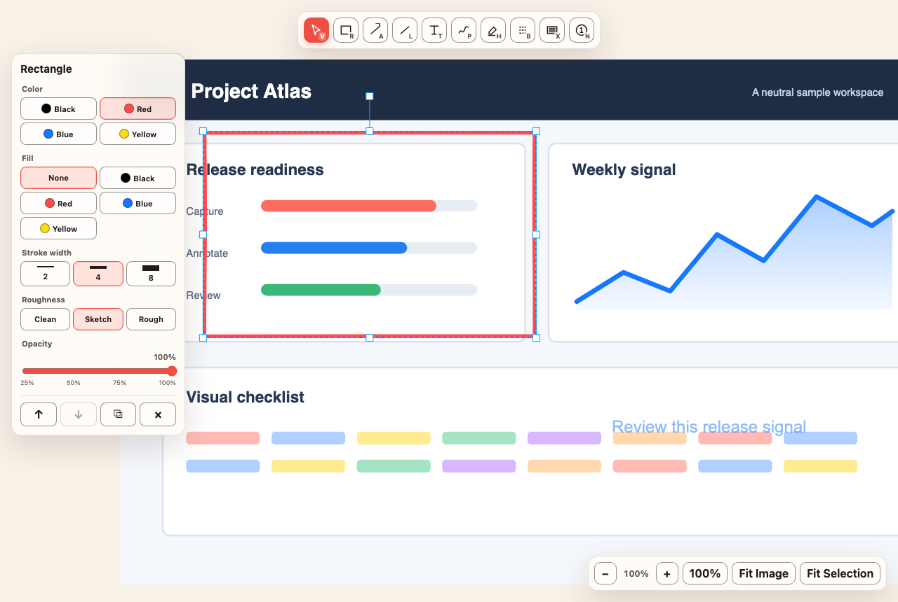

# Inkbeam

Capture fast. Mark freely.



Inkbeam captures a macOS region or the visible content of the active Chrome
tab, then opens it in one editable local canvas. Captures stay on your Mac.

## Features

- Native region capture with `Command-Shift-2`
- Chrome visible-viewport capture without tabs, address bar, or toolbars
- Rectangle, arrow, line, text, freehand, highlighter, blur, redaction, and
  numbered-marker annotations
- Live annotation previews while dragging
- Move, resize, rotate, duplicate, reorder, multi-select, undo, and redo
- Copy Image, source-resolution PNG export, and editable `.inkbeam` projects
- Local-only capture processing with no account, upload, analytics, telemetry,
  or background network transfer

## Release status

The source tree now uses only the Inkbeam runtime identity. The signed,
notarized, updateable `v0.2.0` distribution is a separate release track; this
repository state does not claim that installation, signing, notarization, or
public-release acceptance has completed.

For a release candidate, install Inkbeam in `/Applications` before launching
it. A release build outside that location does not initialize the updater,
Chrome host or inbox, or global shortcut services. Release Candidate versus
Stable is a build-time feed choice, not a beta toggle in the app.

<!-- historical-v0.1.0:start -->
The historical MyShottr `v0.1.0` release is a deprecated, unsigned pre-Inkbeam
prototype. It used `.myshottr` projects and the Quick Ink interface name. Its
[release notes](docs/releases/v0.1.0.md),
[installation evidence](docs/testing/historical/v0.1.0/release-installation.md),
and [manual acceptance record](docs/testing/historical/v0.1.0/v1-acceptance.md)
remain unchanged as historical evidence; they are not current Inkbeam install
instructions or compatibility contracts.
<!-- historical-v0.1.0:end -->

## Use

- Press `Command-Shift-2` or choose **Capture Area** from the menu bar for a
  native region.
- Click the Chrome extension or press `Option-Shift-2` for the active tab's
  visible viewport.
- Captures open directly in the editor without a recovery chooser.
- Press `Command-Shift-C` to copy the complete composited image.
- Press `Command-S` to save an editable `.inkbeam` project.
- Press `Command-E` to export a source-resolution PNG.
- Press `Command-C` and `Command-V` to copy and paste selected annotations.
- Press `?` to open shortcut help. `Escape` closes it and restores focus.
- Hold `Space` and drag, drag with the middle mouse button, or scroll to pan.
  Pinch or use `Command`-scroll to zoom around the pointer. `Command-0` sets 100%,
  `Shift-1` fits the complete image, and `Shift-2` fits the current selection.
- Hold `Shift` while drawing to constrain rectangles, arrows, and lines.
- With Selection (`V`), drag empty canvas to preview a marquee and select
  intersecting annotations. `Shift`-click toggles one annotation.
- Use `Command-D` to duplicate the selection, or hold `Option` while dragging.
- The Context Rail is hidden when Selection has no selection. A drawing tool
  shows defaults for the next mark; selected marks show editable shared
  properties, with differing multi-selection values labeled `Mixed`.
- The native toolbar order is Copy Image, Undo, Redo, flexible space, Save
  Project, and Export PNG. Copy success hides the window without closing the
  document; failure leaves it visible.
- The editor follows the document window's Light or Dark appearance. Reduce
  Motion disables Context Rail reflow animation.
- Save feedback becomes `Saved` only after native completion. Later edits mark
  that successful save as superseded.

## Annotation shortcuts

| Tool | Key |
| --- | --- |
| Select | `V` |
| Rectangle | `R` |
| Arrow | `A` |
| Line | `L` |
| Text | `T` |
| Freehand | `P` |
| Highlighter | `H` |
| Blur | `B` |
| Redaction | `X` |
| Number marker | `N` |

Selection and editing shortcuts:

- Undo / redo: `Command-Z` / `Command-Shift-Z`
- Copy / paste selected annotations: `Command-C` / `Command-V`
- Duplicate selection: `Command-D` or `Option`-drag
- Bring forward / send backward: `Command-]` / `Command-[`
- Delete selection: `Delete` or `Backspace`
- Nudge selection: Arrow keys (`Shift` for 10 px)
- Edit one selected text annotation: `Enter`
- Toggle one annotation in the selection: `Shift`-click
- 100% / Fit Image / Fit Selection: `Command-0` / `Shift-1` / `Shift-2`
- Pan: `Space`-drag, middle-button drag, or scroll
- Zoom around pointer: pinch or `Command`-scroll
- Shortcut help: `?`

Blur is a visual effect, not secure redaction. Use Redaction when pixels must
be fully covered in the exported image.

## Privacy

Captures, projects, inbox files, clipboard output, and exports stay on the Mac.
Inkbeam has no account, cloud upload, analytics, or telemetry. The bundled
editor blocks remote navigation and network access. The Chrome extension uses
only `activeTab` and `nativeMessaging`; it has no content script, persistent
host permission, page URL storage, or alternate capture mechanism.

The updater is the only exception to the local-only network boundary. On the
first launch it makes no automatic check. On the second launch, Sparkle asks
for consent once before automatic checks are enabled. If you approve, the
first automatic request is a GET for either
`https://gihwan-dev.github.io/inkbeam/appcast.xml` or
`https://gihwan-dev.github.io/inkbeam/appcast-beta.xml`; later automatic
checks are eligible every 24-hour interval. A download that you choose from
an offered update is limited to the corresponding
`https://github.com/gihwan-dev/inkbeam/releases/download/<tag>/<asset>` release
asset. If you
decline, only **Check for Updates** can make an update request.

Inkbeam has no automatic download or installation, including silent or
background installation, no system profiling, and no analytics, usage
collection, or telemetry. It has no
beta or release-candidate selector in the app, no first-launch automatic check,
and no runtime feed or channel switching. JavaScript release notes are disabled.
The standard Sparkle consent UI, its
actual HTTPS request, and signed-update verification remain mandatory real
Sparkle RC acceptance checks; automated tests exercise the real Sparkle consent
and request orchestration policy but do not claim TLS or signature verification.

Run `Scripts/verify-privacy.sh` after building to check the local-only editor
bundle and exact Chrome permission contract.

## Development

Prerequisites: macOS 15+, Xcode 26+ with Swift 6, Node 22+, pnpm 10.14+, and
[XcodeGen](https://github.com/yonaskolb/XcodeGen).

```bash
pnpm install --frozen-lockfile
Scripts/verify-inkbeam.sh
```

Generate and open the authoritative XcodeGen project:

```bash
xcodegen generate
open Inkbeam.xcodeproj
```

Automated verification does not replace the
[Inkbeam manual acceptance record](docs/testing/inkbeam-acceptance.md). A
candidate is not manually accepted while any required item is `BLOCKED` or
unverified.

## Current limitations

- Chrome capture is visible-viewport only; full-page capture is rejected.
- HTML element capture, OCR, capture history, video, and audio are not included.
- Safari and Firefox are not supported. Chromium variants other than Google
  Chrome are not guaranteed.
- Full-display, window-specific, and multi-display-spanning native capture are
  not included.
- Developer ID distribution signature, Apple notarization, real Sparkle RC
  acceptance, and public-release acceptance remain unverified release work.

## License

Inkbeam is available under the [MIT License](LICENSE).
