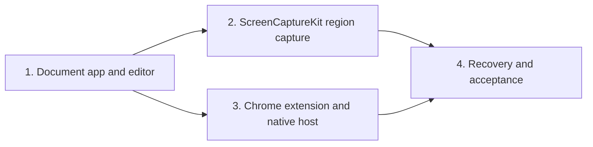

# MyShottr v1 Implementation Roadmap

> Superseded for public distribution by
> [`2026-07-30-myshottr-v1-public-release-roadmap.md`](./2026-07-30-myshottr-v1-public-release-roadmap.md).
> Retained as the historical internal-v1 roadmap.

> **For agentic workers:** REQUIRED SUB-SKILL: Use superpowers:subagent-driven-development (recommended) or superpowers:executing-plans to implement this plan task-by-task. Steps use checkbox (`- [ ]`) syntax for tracking.

**Goal:** Deliver the complete personal-use MyShottr v1 through four independently reviewable and testable increments.

**Architecture:** The native document app and editor establish the stable project boundary first. Native region capture and Chrome visible-viewport capture then enter through that same boundary, followed by recovery, security hardening, and exact-SHA acceptance verification.

**Tech Stack:** Swift 6, SwiftUI, AppKit, ScreenCaptureKit, WKWebView, XcodeGen, TypeScript, React, Konva, rough.js, Zod, Chrome Manifest V3, Native Messaging, XCTest, Vitest, Playwright

## Global Constraints

- Execute the four plans in the order listed below.
- Finish every plan's completion gate before starting the next plan.
- Do not combine task commits across plan boundaries.
- Preserve the approved v1 exclusions in the design document.
- Do not introduce fallback capture implementations.
- Final completion requires the automated gate and manual acceptance evidence at the exact same commit SHA.

---

## Execution Order

- [ ] **Increment 1: Foundation and editor**

Plan:
[`2026-07-29-myshottr-foundation-editor.md`](./2026-07-29-myshottr-foundation-editor.md)

Deliverable: a runnable app that opens fixture `.myshottr` projects, supports
all annotation interactions, and saves, copies, and exports source-resolution
results.

- [ ] **Increment 2: Native region capture**

Plan:
[`2026-07-29-myshottr-native-capture.md`](./2026-07-29-myshottr-native-capture.md)

Consumes: `MyShottrProject`, `DocumentSession`, and
`DocumentWindowController` from Increment 1.

Deliverable: `Command-Shift-2` and the menu bar capture a one-display macOS
region through ScreenCaptureKit and open it in the same editor.

- [ ] **Increment 3: Chrome visible-viewport capture**

Plan:
[`2026-07-29-myshottr-chrome-capture.md`](./2026-07-29-myshottr-chrome-capture.md)

Consumes: the project creation and editor pipeline from Increments 1 and 2.

Deliverable: Chrome captures active-tab page pixels without browser chrome and
imports them through a validated Native Messaging helper.

- [ ] **Increment 4: Recovery, hardening, and acceptance**

Plan:
[`2026-07-29-myshottr-recovery-hardening.md`](./2026-07-29-myshottr-recovery-hardening.md)

Consumes: every prior subsystem.

Deliverable: recovery, exhaustive actionable errors, local-only privacy gates,
and automated plus manual exact-SHA v1 acceptance.

## Dependency Contract



Increment 2 and Increment 3 are architecturally independent after Increment 1,
but execute them in the documented order so reviewers see a working native
screenshot product before browser integration.

## Design Coverage

| Approved design requirement | Owning implementation task |
| --- | --- |
| `.myshottr` package and later editing | Foundation Task 2 and Task 6 |
| Seven drawable annotations plus selection | Foundation Task 3 and Task 4 |
| Excalidraw-style direct manipulation | Foundation Task 4 |
| source-resolution copy and PNG export | Foundation Task 6 |
| ScreenCaptureKit region selection | Native Capture Tasks 1–4 |
| menu bar and `Command-Shift-2` | Native Capture Task 4 |
| clean visible Chrome viewport | Chrome Capture Task 1 and Task 4 |
| Native Messaging validation and inbox | Chrome Capture Task 2 and Task 3 |
| explicit permission and failure handling | Native Capture Task 2 and Hardening Task 2 |
| two-second current-document recovery | Hardening Task 1 |
| local-only privacy boundary | Hardening Task 3 |
| automated and manual acceptance evidence | Hardening Task 4 |

No approved requirement is deferred outside these plans. The design's explicit
non-goals remain non-goals and do not receive placeholder tasks.

## Implementation References

- [Apple ScreenCaptureKit](https://developer.apple.com/documentation/screencapturekit)
- [Apple `SCScreenshotManager`](https://developer.apple.com/documentation/screencapturekit/scscreenshotmanager)
- [Apple `sourceRect`](https://developer.apple.com/documentation/screencapturekit/scscreenshotconfiguration/sourcerect)
- [Chrome `captureVisibleTab`](https://developer.chrome.com/docs/extensions/reference/api/tabs)
- [Chrome Native Messaging](https://developer.chrome.com/docs/extensions/develop/concepts/native-messaging)
- [Playwright Chrome extensions](https://playwright.dev/docs/chrome-extensions)
- [Konva React Transformer](https://konvajs.org/docs/react/Transformer.html)
- [rough.js](https://github.com/rough-stuff/rough)
- [XcodeGen](https://github.com/yonaskolb/XcodeGen)

## Final Gate

The roadmap is complete only when:

```bash
Scripts/verify-v1.sh
```

passes, `git status --short` is empty, and
`git notes --ref=myshottr-acceptance show HEAD` contains all 18 passing checks
for that exact commit.
