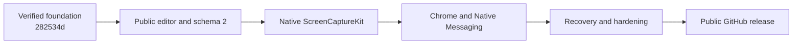

# MyShottr v1 Public Release Implementation Plan

> **For agentic workers:** REQUIRED SUB-SKILL: Use superpowers:subagent-driven-development (recommended) or superpowers:executing-plans to implement this plan task-by-task. Steps use checkbox (`- [ ]`) syntax for tracking.

**Goal:** Complete every remaining subsystem from the verified editor baseline through a live, downloadable, public MyShottr `v0.1.0` GitHub Release.

**Architecture:** Preserve the completed native-document and WebKit-editor boundary, add the public editor contract before capture sources depend on it, then implement native and Chrome capture, recovery and privacy hardening, and finally exact-SHA public packaging and deployment. Each plan has its own test and review gate and may not be skipped.

**Tech Stack:** Swift 6, SwiftUI, AppKit, ScreenCaptureKit, WebKit, TypeScript, React, Konva, rough.js, Zod, Chrome Manifest V3, Native Messaging, XCTest, Vitest, Playwright, GitHub Actions

## Global Constraints

- Execute the plans in the exact order below.
- Foundation/editor commit `282534d` is verified complete and is not reimplemented.
- Public release design `2026-07-30-myshottr-v1-public-release-design.md` overrides conflicting internal-only statements in the 2026-07-29 design.
- Minimum supported macOS version is exactly macOS 15.
- Do not add capture fallbacks.
- Do not add full-page capture or mockup UI in `v0.1.0`.
- Keep every capture and project local to the Mac.
- Public repository is exactly `gihwan-dev/MyShottr`.
- Initial release is unsigned, unnotarized, MIT-licensed `v0.1.0`.
- A plan may start only after the prior plan's completion gate is green and committed.
- Final completion requires live verification of the remote repository, tag, CI, release assets, checksums, and downloaded installation.

---

## Execution Order

- [x] **Baseline: Foundation and editor**

Plan:
[`2026-07-29-myshottr-foundation-editor.md`](./2026-07-29-myshottr-foundation-editor.md)

Verified deliverable: format-1 project package, local-only WebKit editor, seven
existing annotation types, undo/redo, clipboard PNG, project save, and PNG
export. Baseline commit: `282534d`.

- [ ] **Increment 1: Public editor contract and Quick Ink branding**

Plan:
[`2026-07-30-myshottr-editor-public-polish.md`](./2026-07-30-myshottr-editor-public-polish.md)

Deliverable: schema 2 with `presentation: none`, deterministic migration,
shared new-project factory, remembered preferences, line, blur, complete
keyboard workflow, icon-first Quick Ink UI, AppIcon, and status icon.

- [ ] **Increment 2: Native region capture**

Plan:
[`2026-07-29-myshottr-native-capture.md`](./2026-07-29-myshottr-native-capture.md)

Consumes: `NewProjectCreating`, schema 2, the status icon, document windows, and
the existing editor.

Deliverable: ScreenCaptureKit region selection, permission UX, menu-bar
commands, `Command-Shift-2`, and one new document per capture.

- [ ] **Increment 3: Chrome visible-viewport capture**

Plan:
[`2026-07-29-myshottr-chrome-capture.md`](./2026-07-29-myshottr-chrome-capture.md)

Consumes: `NewProjectCreating`, document windows, menu-bar app lifecycle, and
the fixed extension identity.

Deliverable: `BrowserCaptureMode`, visible-viewport extension capture, bounded
Native Messaging, durable owner-only inbox, host registration, app activation,
and real Chrome acceptance without browser chrome.

- [ ] **Increment 4: Recovery, errors, privacy, and release-candidate gate**

Plan:
[`2026-07-29-myshottr-recovery-hardening.md`](./2026-07-29-myshottr-recovery-hardening.md)

Consumes: every runtime subsystem.

Deliverable: per-document debounced recovery, exhaustive actionable errors,
deny-by-default WebView navigation, privacy verification, the complete
automated gate, and exact-SHA manual product acceptance.

- [ ] **Increment 5: Public GitHub distribution**

Plan:
[`2026-07-30-myshottr-public-distribution.md`](./2026-07-30-myshottr-public-distribution.md)

Consumes: the clean exact-SHA accepted release candidate.

Deliverable: MIT License, real screenshots, public README, packaging scripts,
CI, tag-triggered release workflow, public repository, remote `main`,
`v0.1.0`, downloadable app and extension ZIPs, checksums, and downloaded-file
installation evidence.

## Dependency Contract



## Public Design Coverage

| Approved requirement | Owning plan |
| --- | --- |
| arbitrary-size capture artifact boundary | public editor + native + Chrome |
| future full-page mode contract | Chrome capture |
| future presentation/mockup boundary | public editor |
| region capture and cancellation | native capture |
| clean Chrome viewport | Chrome capture |
| line and source-only blur | public editor |
| retained redaction and number markers | public editor regression gate |
| remembered tools and styles | public editor |
| editable project and schema migration | public editor |
| multi-document crash recovery | recovery and hardening |
| Quick Ink editor, AppIcon, status icon | public editor |
| no network, telemetry, or broad Chrome access | recovery and hardening |
| public MIT repository and README | public distribution |
| unsigned app and unpacked extension ZIPs | public distribution |
| checksums and tag-triggered release | public distribution |
| downloaded-artifact install verification | public distribution |

## Commit and Review Discipline

Every task ends with the commit listed in its plan. After each task:

```bash
git diff HEAD^ --check
git status --short
```

Review the task diff against its `Interfaces` block and focused tests before
starting the next task. Do not combine task commits or start the next increment
with a dirty worktree.

## Final Gate

The roadmap is complete only when all subordinate plan gates pass and:

```bash
test -z "$(git status --short)"
test "$(git rev-parse v0.1.0^{})" = \
  "$(git ls-remote origin 'refs/tags/v0.1.0^{}' | awk '{print $1}')"
git notes --ref=myshottr-acceptance show v0.1.0^{}
git notes --ref=myshottr-release-install show v0.1.0^{}
gh run list --repo gihwan-dev/MyShottr --limit 10
gh release view v0.1.0 --repo gihwan-dev/MyShottr
```

shows a clean local tree, exact local/remote tag equality, complete product and
install evidence, green CI and Release workflows, and the three approved
downloadable artifacts.
