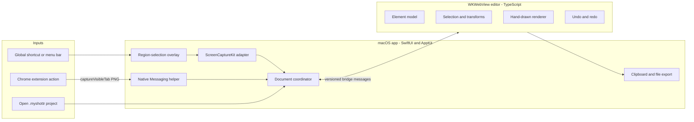

# MyShottr v1 Design

- Date: 2026-07-29
- Status: Approved for implementation planning
- Product scope: Personal or internal macOS use
- Development environment: macOS 26.5.2, Xcode 26.6, Swift 6.3.3, Chrome 150
- Minimum supported macOS version: macOS 15

## 1. Summary

MyShottr is a local-first macOS screenshot and annotation app. It captures a
desktop region or the visible content area of the active Chrome tab, opens the
result in an Excalidraw-style direct-manipulation editor, and copies, exports,
or saves the result for later editing.

The v1 implementation uses a native SwiftUI/AppKit shell for system integration
and a TypeScript canvas editor embedded in `WKWebView`. A Chrome Manifest V3
extension captures browser content and transfers it to the app through a
registered Native Messaging host.

## 2. Confirmed Product Decisions

- Web capture is a core v1 feature, not a later add-on.
- Chrome is the only officially supported browser in v1.
- Web capture includes only the currently visible page viewport.
- Browser tabs, address bars, and toolbars must not appear in web captures.
- Projects can be saved and reopened for later editing.
- The editor uses Excalidraw-style direct manipulation and hand-drawn visuals.
- The editor is a bounded, single-image canvas rather than an infinite
  whiteboard.
- The Canvas First layout is used: a floating tool palette and contextual
  property controls sit over a maximized canvas.
- v1 is for personal or internal use. It has no account, billing, licensing, or
  public distribution system.

## 3. Goals

1. Capture a macOS screen region with a global shortcut or menu-bar command.
2. Capture the visible content of the active Chrome tab without browser chrome.
3. Route every capture source into the same editing and document pipeline.
4. Provide eight annotation tools:
   - selection
   - rectangle
   - arrow
   - text
   - freehand drawing
   - highlighter
   - opaque redaction
   - numbered marker
5. Copy a composited PNG to the macOS clipboard.
6. Export a composited PNG at the source image's pixel dimensions.
7. Save and reopen an editable `.myshottr` project.
8. Keep all capture data local to the Mac.

## 4. Non-Goals

The following are explicitly excluded from v1:

- scrolling or full-page web capture
- HTML element capture
- Safari, Edge, Arc, Brave, or other browser support guarantees
- full-screen and window-specific native capture modes
- capture selections that span multiple displays
- blur or pixelation; v1 redaction is an opaque covering object
- OCR
- capture history or a screenshot library
- cloud sync or collaboration
- accounts, licensing, billing, or telemetry
- video or audio capture
- automatic updates
- App Store packaging

## 5. Architecture

### 5.1 Technology Choices

- Native app: Swift 6, SwiftUI, AppKit, ScreenCaptureKit, and `WKWebView`
- Editor: TypeScript, React, Konva, rough.js, and Zod
- Editor packaging: a local production bundle embedded in the app; no runtime
  CDN or remote asset
- Chrome integration: Manifest V3 extension and a Swift command-line Native
  Messaging helper bundled inside the app
- Native tests: XCTest
- Editor and extension tests: Vitest, with Playwright used for Chrome extension
  integration fixtures

Konva owns canvas scene management, hit testing, selection handles, and
transforms. rough.js supplies deterministic hand-drawn path data that renders
as Konva `Path` nodes. Zod validates persisted documents and every
JavaScript-side bridge message. MyShottr does not embed the Excalidraw
application or adopt its infinite-canvas document model.

### 5.2 Component Flow



The system has four primary boundaries:

1. The Chrome extension owns only browser capture and user-facing extension
   errors.
2. The Native Messaging helper validates and stages captured browser images.
3. The macOS app owns permissions, windows, files, clipboard operations, and
   document lifecycle.
4. The web editor owns annotation state, interaction, rendering, and undo/redo.

The native app never edits the source image. The editor never reads arbitrary
files or invokes system APIs directly.

## 6. Native Screen Capture

### 6.1 Entry Points

- Default global shortcut: `Command-Shift-2`
- Menu-bar command: `Capture Area`
- Menu-bar secondary commands: `Open Project` and `Quit`

Shortcut customization is not part of v1.

### 6.2 Selection

Starting capture creates one borderless AppKit overlay window per display. The
pointer-down display becomes the active capture display, and the selection must
remain within that display. The user drags a rectangle and can:

- press `Escape` to cancel;
- press `Return` to confirm the current selection;
- drag a handle to resize the current selection;
- click and drag inside the selection to move it.

The overlay hides before capture and is excluded from the captured content.
Capture coordinates are converted from AppKit points to source-image pixels
using the active display scale.

### 6.3 Capture API

The app uses ScreenCaptureKit and `SCScreenshotManager` as the primary capture
path. It requests Screen Recording permission and declares
`NSScreenCaptureUsageDescription`. It does not use deprecated screen-capture
APIs as a fallback.

## 7. Chrome Capture

### 7.1 Extension

The Chrome extension uses Manifest V3 and requests only:

- `activeTab`
- `nativeMessaging`

An extension action and a Chrome command invoke
`chrome.tabs.captureVisibleTab()` with PNG output. This captures the currently
visible web content area without browser tabs, address bars, or toolbars.

The extension does not inject a content script and does not request persistent
host access.

### 7.2 Native Messaging

The extension service worker sends this message to the registered helper:

```json
{
  "protocolVersion": 1,
  "type": "capture",
  "captureMode": "visibleViewport",
  "mimeType": "image/png",
  "dataBase64": "<base64 PNG>"
}
```

The helper accepts exactly these five fields, protocol version `1`, message type
`capture`, capture mode `visibleViewport`, and MIME type `image/png`.
`fullPage` is an explicit unsupported mode and is rejected before image
decoding or staging. The decoded image limit is 45 MiB so that base64 expansion,
JSON framing, and the message prefix remain below Chrome's 64 MiB
Chrome-to-native-host limit.

The helper:

1. validates and decodes the PNG;
2. writes it with owner-only permissions to
   `~/Library/Application Support/MyShottr/Inbox/<capture-id>.png`;
3. launches or activates MyShottr;
4. notifies a running app using `DistributedNotificationCenter`, passing only
   the generated capture ID;
5. returns a small success or error acknowledgement to Chrome.

The bounded capture failure codes are `HOST_UNAVAILABLE`, `INVALID_MESSAGE`,
`UNSUPPORTED_CAPTURE_MODE`, `INVALID_IMAGE`, `IMAGE_TOO_LARGE`,
`STAGING_FAILED`, and `APP_ACTIVATION_FAILED`. `HOST_UNAVAILABLE` is produced
when Chrome cannot reach the helper; the remaining codes are exact helper
replies.

`STAGING_FAILED` means no new capture was durably published and the helper did
not attempt to activate the app. If the PNG was published atomically but the
app could not be opened, the helper returns `APP_ACTIVATION_FAILED` and keeps
that one owner-only pending PNG. It neither retries nor deletes the file;
opening MyShottr later imports it through the launch inbox scan.

The app resolves the ID inside its own inbox, verifies that the file is a
regular owner-controlled PNG, imports it, and deletes the inbox file. Arbitrary
paths are never accepted from the extension. On launch, the app also scans the
inbox for every pending capture, so the same flow works when the app was not
already running or helper activation failed.

On first launch, the app installs the per-user Native Messaging host manifest
at
`~/Library/Application Support/Google/Chrome/NativeMessagingHosts/com.myshottr.capture.json`.
The manifest points to the helper's absolute path inside the app bundle. The
extension uses a fixed manifest key so its extension ID and `allowed_origins`
value stay stable during internal distribution.

## 8. Editor

### 8.1 Layout

The editor window gives the canvas all remaining space. It contains:

- native title-bar actions for Copy, Save, and Export;
- a centered floating tool palette;
- a contextual floating style palette for the selected tool or element;
- zoom controls for Zoom In, Zoom Out, Actual Size, and Fit;
- a modified-state indicator in the window title.

There is no persistent sidebar, inspector, layers panel, or minimap.

### 8.2 Canvas Rules

- The logical coordinate system is the source image's pixel coordinate system.
- The canvas bounds equal the source image bounds.
- Panning is available only when the zoomed canvas exceeds the viewport.
- Elements cannot be moved completely outside the source image.
- Export renders at source pixel dimensions, independent of editor zoom.
- Each hand-drawn element stores a stable random seed so reopening or exporting
  does not change its appearance.

### 8.3 Common Element Behavior

All elements have an ID, type, bounds, rotation, opacity, z-order, and
type-specific properties. Selectable elements support:

- click selection;
- shift-click multi-selection;
- drag movement;
- resize handles;
- rotation;
- duplicate with `Command-D`;
- delete with `Delete` or `Backspace`;
- bring forward and send backward;
- copy and paste within the document.

Grouping and a visible layers panel are excluded from v1.

### 8.4 Tool Behavior

| Tool | v1 behavior |
| --- | --- |
| Selection | Select, move, resize, rotate, and multi-select elements. |
| Rectangle | Transparent by default; fill can use the current color at 25%, 50%, 75%, or 100% opacity. |
| Arrow | Two-point arrow with movable endpoints and one arrowhead. |
| Text | Click to create; double-click to edit; auto-sized text box. |
| Freehand | Pressure-independent vector stroke sampled from pointer movement. |
| Highlighter | Translucent freehand stroke rendered behind normal annotations. |
| Redaction | Opaque rectangle whose export pixels fully cover the source. |
| Number marker | Auto-incremented circular marker; number can be overridden. |

Default style choices:

- colors: black, red, blue, and yellow;
- stroke widths: 2, 4, and 8 source pixels;
- text sizes: 16, 24, and 36 source pixels;
- font: the macOS system sans-serif font;
- hand-drawn roughness: 0, 1, or 2;
- opacity: 25%, 50%, 75%, or 100%.

### 8.5 Undo and Redo

The editor uses command-based undo/redo. A pointer drag is coalesced into one
history command. Text typing is coalesced until the editor loses focus or the
user pauses for one second. The current undo stack is not persisted after the
document closes.

## 9. Native-Web Bridge

Every bridge message contains:

```json
{
  "protocolVersion": 1,
  "requestId": "<uuid>",
  "type": "<message type>",
  "payload": {}
}
```

The native app sends:

- `loadDocument`
- `saveCompleted`
- `saveFailed`
- `requestComposite`
- `setAppearance`

The editor sends:

- `editorReady`
- `documentChanged`
- `annotationSnapshot`
- `compositeChunk`
- `compositeCompleted`
- `bridgeError`

Both sides validate the protocol version, message type, required fields, and
payload size. Unknown messages fail explicitly.

The immutable source PNG is exposed to the bundled editor through a
`WKURLSchemeHandler` URL scoped to the active document:
`myshottr-resource://document/<document-id>/original.png`. The handler serves
only that exact resource from in-memory document data and never accepts a
filesystem path. This keeps large source images out of bridge JSON while
preserving the local-only boundary.

For clipboard and PNG export, the editor renders an offscreen canvas at source
pixel dimensions, creates a PNG, and sends base64 data in 512 KiB chunks. The
native app assembles the chunks in a temporary owner-only file, validates the
PNG, and then writes it to the clipboard or destination URL. It deletes partial
files after a failed or cancelled transfer.

## 10. Project Format

A `.myshottr` document is a macOS file package with exactly:

```text
Example.myshottr/
├── manifest.json
├── original.png
└── document.json
```

`manifest.json` contains:

```json
{
  "formatVersion": 1,
  "documentId": "<uuid>",
  "createdAt": "<ISO-8601>",
  "updatedAt": "<ISO-8601>",
  "sourcePixelWidth": 3024,
  "sourcePixelHeight": 1964,
  "sourceKind": "screenRegion"
}
```

`sourceKind` is either `screenRegion` or `chromeVisibleViewport`. The project
does not store a source URL, browser history, window title, or application name.

`document.json` contains the ordered element array and editor defaults. Unknown
element types or unsupported format versions make the project fail to open
with an explicit error; v1 does not silently discard data.

Saving uses an atomic replacement. The app writes a complete package to a
temporary sibling URL and replaces the destination only after every member is
validated.

## 11. Recovery

When a document changes, the native app writes a debounced recovery package
after two seconds of inactivity. Recovery packages live under
`~/Library/Application Support/MyShottr/Recovery/`.

After a clean save or explicit discard, the associated recovery package is
deleted. After an abnormal exit, the next launch offers to restore the latest
modified document. Recovery is not presented as a capture history and retains
only the current recoverable state per open document.

## 12. Error Handling

The product never silently switches capture mechanisms or discards document
data.

| Failure | Behavior |
| --- | --- |
| Screen Recording permission missing | Stop capture, explain the permission, and offer to open the relevant System Settings page. |
| ScreenCaptureKit capture failure | Close the overlay, keep the menu-bar app running, and show the system error. |
| Chrome native host missing | Extension explains that MyShottr must be opened once to register the host. |
| Native message invalid or oversized | Helper rejects it and returns a bounded error code. |
| Native helper staging fails | Helper returns `STAGING_FAILED`, leaves no new pending capture, and does not activate MyShottr. |
| MyShottr activation fails after staging | Helper returns `APP_ACTIVATION_FAILED` and preserves the durable pending PNG for the next app launch scan. |
| Inbox file invalid | App refuses import, removes the staged file, and reports the failure. |
| Editor bridge invalid | App keeps the current native document state and reports an internal editor error. |
| Project corrupt or too new | App refuses to open it without partially importing elements. |
| Save or export fails | Editor remains open and modified; the destination is not replaced. |
| Composite transfer fails | Partial temporary output is deleted and the document remains unchanged. |

## 13. Privacy and Security

- Capture images and projects never leave the Mac.
- The editor loads only the app-bundled local assets and has no remote network
  dependency.
- Chrome uses `activeTab` instead of broad persistent site access.
- Content scripts are not used.
- Native bridge messages and Native Messaging messages are treated as
  untrusted input and schema-validated.
- Temporary and inbox files use owner-only permissions.
- No source URLs, page titles, analytics, or telemetry are stored.

## 14. Testing

### 14.1 Swift Tests

- AppKit-point to display-pixel coordinate conversion at 1x and 2x scales
- negative display origins and multiple-display selection boundaries
- project package validation, atomic save, and reopen
- recovery creation and cleanup
- Native Messaging validation and 45 MiB decoded-size enforcement
- inbox path traversal and symbolic-link rejection
- chunked composite assembly and partial-file cleanup

### 14.2 TypeScript Tests

- creation and transformation of every element type
- selection and multi-selection
- numbered-marker increment and override behavior
- deterministic hand-drawn rendering from stored seeds
- undo/redo coalescing for drag and text input
- serialization round trips
- unsupported element and protocol-version rejection
- compositing at source dimensions independent of zoom

### 14.3 Integration Tests

- ScreenCaptureKit region capture opens a correctly sized document
- Chrome `captureVisibleTab()` reaches the Native Messaging helper
- helper staging opens the same editor pipeline as native capture
- save, close, and reopen preserves every element and style
- copied PNG can be read back from `NSPasteboard`
- image-diff fixtures verify annotation placement at 1x and 2x scales

Permission denial and re-granting, multi-display behavior, Chrome host
registration, and paste behavior in common chat and document applications also
receive a manual release check.

## 15. Acceptance Criteria

v1 is complete when:

1. `Command-Shift-2` opens region selection and a successful capture opens the
   editor.
2. Chrome capture contains the visible webpage but no browser chrome.
3. All seven drawable annotation types can be created, selected, transformed,
   duplicated, and deleted through the selection tool.
4. Undo and redo cover all document-changing editor actions.
5. clipboard output pastes as a PNG into common chat and document applications.
6. exported PNG dimensions match the source image dimensions.
7. a saved `.myshottr` project reopens with pixel-identical source content and
   equivalent element state.
8. abnormal termination can recover the latest modified document.
9. denied permissions, missing native host registration, corrupt projects, and
   failed exports produce explicit actionable errors.
10. no capture or document data is transmitted to an external server.

## 16. Primary API References

- [Apple ScreenCaptureKit](https://developer.apple.com/documentation/screencapturekit)
- [Apple SCScreenshotManager](https://developer.apple.com/documentation/screencapturekit/scscreenshotmanager)
- [Apple screen capture sample](https://developer.apple.com/documentation/screencapturekit/capturing-screen-content-in-macos)
- [Chrome tabs API](https://developer.chrome.com/docs/extensions/reference/api/tabs)
- [Chrome Native Messaging](https://developer.chrome.com/docs/extensions/develop/concepts/native-messaging)
