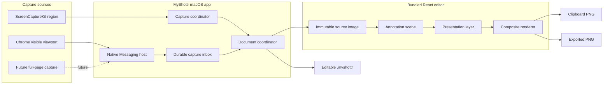

# MyShottr v1 Public Release Design

- Date: 2026-07-30
- Status: Approved
- Release target: Public GitHub repository and unsigned GitHub Release
- Repository: `gihwan-dev/MyShottr`
- License: MIT
- Initial release: `v0.1.0`
- Minimum supported macOS version: macOS 15

## 1. Purpose and Authority

MyShottr is a local-first macOS screenshot and annotation app. It captures a
desktop region or the visible content area of the active Chrome tab, opens the
result in an Excalidraw-style editor, and lets the user copy, export, or save
the result for later editing.

This document extends
[`2026-07-29-myshottr-v1-design.md`](./2026-07-29-myshottr-v1-design.md)
from an internal-use product into a public v1 release. The earlier document
remains authoritative for technical details that are not changed here. When
the two documents conflict, this public-release design takes precedence.

The main changes are:

- public open-source distribution under the MIT License;
- an unsigned `v0.1.0` GitHub Release;
- a separately packaged, unpacked Chrome extension;
- Quick Ink branding and a production app icon;
- an extensible capture and presentation pipeline;
- future support boundaries for full-page capture and desktop mockups;
- line and blur annotations in addition to the already implemented tools.

## 2. Confirmed Product Decisions

- Native region capture and clean Chrome viewport capture are both required for
  v1.
- Chrome capture includes only the currently visible webpage viewport.
- Browser tabs, the address bar, bookmarks, toolbars, and developer tools must
  not appear in the captured image.
- Chrome integration uses Manifest V3, `captureVisibleTab`, and Native
  Messaging.
- The Chrome extension is distributed as a ZIP and installed in developer mode
  for `v0.1.0`.
- MyShottr is distributed from a public GitHub repository.
- The source is licensed under MIT.
- `v0.1.0` is unsigned and not notarized.
- The app remains local-only: no account, cloud upload, analytics, or
  telemetry.
- Full-page scrolling capture and desktop mockups are future features, but v1
  architecture must not make either feature require a document-model rewrite.

## 3. v1 Scope

### 3.1 Capture

- menu-bar `Capture Area` command;
- global `Command-Shift-2` shortcut;
- one-display region selection through ScreenCaptureKit;
- cancellation with `Escape`;
- active Chrome tab visible-viewport capture;
- automatic delivery of a Chrome capture to the same editor used by native
  capture.

### 3.2 Editing

- selection and direct manipulation;
- rectangle;
- arrow;
- line;
- text;
- freehand drawing;
- highlighter;
- blur region;
- opaque redaction;
- numbered marker;
- move, resize, rotate, duplicate, delete, and z-order changes;
- undo and redo;
- color, stroke width, text size, opacity, and hand-drawn roughness controls;
- zoom, fit, and pan;
- remembered last-used tool defaults.

Blur is an annotation effect, not a security guarantee. Opaque redaction
remains available for information that must be irreversibly covered in the
exported image.

### 3.3 Output and Persistence

- copy a source-resolution composited PNG to the clipboard;
- export a source-resolution PNG;
- atomically save and reopen an editable `.myshottr` document;
- recover modified documents after abnormal termination;
- keep separate documents in separate windows so a new capture cannot overwrite
  an existing edit.

### 3.4 Public Distribution

- public GitHub repository;
- complete README;
- MIT `LICENSE`;
- Quick Ink app and menu-bar icons;
- tag-triggered release automation;
- macOS app ZIP;
- Chrome extension ZIP;
- SHA-256 checksums;
- installation instructions for an unsigned macOS app and an unpacked Chrome
  extension.

## 4. Explicit Non-Goals

The following are not part of `v0.1.0`:

- full-page or scrolling web capture;
- HTML element selection;
- desktop, browser, device, or social-card mockups;
- Safari or Firefox support;
- guaranteed support for Chromium variants other than Chrome;
- full-display and window-specific native capture modes;
- capture selections spanning multiple displays;
- OCR;
- capture history or a screenshot library;
- cloud sync or collaboration;
- accounts, billing, licensing servers, or telemetry;
- automatic updates;
- Developer ID signing or Apple notarization;
- Mac App Store or Chrome Web Store distribution.

## 5. Architecture

### 5.1 Components



The system has four ownership boundaries:

1. A capture source produces a validated `CaptureArtifact`.
2. The native app owns permissions, capture delivery, windows, persistence,
   clipboard, and filesystem operations.
3. The bundled editor owns annotations, interactions, undo/redo, and
   compositing.
4. Presentation decorates the composed screenshot without mutating the source
   image or annotation scene.

### 5.2 Capture Artifact

Every source normalizes its result before the editor sees it:

```text
CaptureArtifact
├── id
├── sourceKind
├── imageData
├── pixelWidth
├── pixelHeight
├── scale
└── captureMetadata
```

The editor must not contain viewport-specific assumptions. It receives an
immutable image with arbitrary valid pixel dimensions. A future full-page
source may assemble scrolling tiles before creating the artifact, so it can
enter the same document path without changing editor behavior.

The v1 `sourceKind` values are:

- `screenRegion`
- `chromeVisibleViewport`

Future source kinds may include `screenDisplay`, `screenWindow`, and
`chromeFullPage`. Unsupported newer kinds fail explicitly instead of being
silently reinterpreted.

### 5.3 Presentation Layer

The document rendering order is:

```text
source image -> annotation scene -> presentation -> output
```

`v0.1.0` supports only `presentation.type = "none"`. The explicit layer
boundary allows future presentation types such as `desktopMockup`,
`browserFrame`, background color or gradient, padding, rounded corners, and
shadow.

A future mockup wraps the already annotated screenshot. It does not flatten or
rewrite the source image and annotations. This keeps existing projects
editable when presentation features arrive.

## 6. Native Capture Flow

1. The user selects `Capture Area` or presses `Command-Shift-2`.
2. MyShottr verifies Screen Recording permission.
3. One borderless selection overlay is created per display.
4. Pointer-down chooses the active display; the selection remains within that
   display.
5. `Escape` cancels without opening an empty editor.
6. The overlay hides before `SCScreenshotManager` captures the selected pixel
   rectangle.
7. The result becomes a `CaptureArtifact`.
8. A new document window opens and receives focus.

ScreenCaptureKit is the only native capture mechanism. MyShottr does not
silently switch to a different capture API.

## 7. Chrome Capture Flow

### 7.1 Extension

The extension requests only:

- `activeTab`
- `nativeMessaging`

Its action and keyboard command call `chrome.tabs.captureVisibleTab()` with PNG
output. It has no content script and no persistent host permission.

A manifest key pins the unpacked extension to a stable extension ID. The Native
Messaging host manifest accepts only that origin.

### 7.2 Native Messaging and Durable Inbox

The extension sends a versioned message containing the PNG. The helper accepts
only the supported protocol version, message type, PNG MIME type, and bounded
payload size. The existing 45 MiB decoded-image limit remains in force.

The helper:

1. validates and decodes the message;
2. writes an owner-only PNG to
   `~/Library/Application Support/MyShottr/Inbox/` using atomic replacement;
3. launches or activates MyShottr;
4. signals only the generated capture ID;
5. acknowledges success after the durable inbox write completes.

The app resolves the ID inside its own inbox, rejects symbolic links and
non-regular files, validates the PNG, opens a new document, and removes the
processed inbox entry.

The app registers or refreshes the per-user Native Messaging manifest on
launch. Moving the app to a different path is handled by rewriting the manifest
with the current bundled-helper path.

## 8. Editor Experience

### 8.1 Visual Direction

The editor follows an Excalidraw-inspired, canvas-first layout without
embedding the Excalidraw application:

- warm ivory workspace;
- floating icon-first tool palette;
- contextual style controls;
- coral selection and primary-action accents;
- hand-drawn geometry generated from stable seeds;
- untouched screenshot pixels beneath annotations;
- tooltips that include tool names and keyboard shortcuts.

The app remembers the last-used tool, color, stroke width, text size, opacity,
and roughness for the next capture.

### 8.2 Keyboard Model

| Action | Shortcut |
| --- | --- |
| Selection | `V` |
| Rectangle | `R` |
| Arrow | `A` |
| Line | `L` |
| Text | `T` |
| Freehand | `P` |
| Highlighter | `H` |
| Blur | `B` |
| Redaction | `X` |
| Number marker | `N` |
| Duplicate | `Command-D` |
| Undo | `Command-Z` |
| Redo | `Command-Shift-Z` |
| Copy selected annotations | `Command-C` |
| Copy composited image | `Command-Shift-C` |
| Save project | `Command-S` |
| Export PNG | `Command-E` |

Trackpad pinch zooms the canvas. Holding Space while dragging pans a zoomed
canvas.

### 8.3 Output Actions

The title-bar actions use explicit labels:

- **Copy Image** renders and copies the complete composited PNG.
- **Save Project** saves the editable `.myshottr` document.
- **Export PNG** writes the complete composited PNG to a chosen location.

Zoom and pan never affect output dimensions. Export and clipboard rendering use
the source image's pixel coordinate system.

## 9. Project Format and Evolution

A `.myshottr` document is presented by Finder as one document and stores:

```text
Example.myshottr/
├── manifest.json
├── original.png
└── document.json
```

The manifest and editor document are versioned independently from the runtime
bridge protocol. The model includes:

```text
MyShottrDocument
├── schemaVersion
├── source
│   ├── kind
│   ├── pixelSize
│   └── captureMetadata
├── annotations[]
├── presentation
└── editorDefaults
```

The public `v0.1.0` format writes `presentation: { "type": "none" }`. Existing
pre-release format-1 fixtures are migrated deterministically during the public
release work. Unsupported newer format versions fail without discarding
unknown data.

Persistence is implemented behind a serializer boundary. If future large
full-page images or mockup assets require a portable ZIP container, the
serializer can change without changing editor state or capture-source
contracts.

Saving writes a complete sibling package and atomically replaces the
destination only after validation succeeds.

## 10. Recovery and Document Lifecycle

- Every capture opens a separate document window.
- A modified document writes an atomic recovery snapshot after a short debounce.
- Recovery snapshots live under
  `~/Library/Application Support/MyShottr/Recovery/`.
- An abnormal exit causes the next launch to offer recoverable documents.
- A successful save or explicit discard removes the corresponding snapshot.
- Closing a modified document presents `Save`, `Discard`, and `Cancel`.
- Failed save, export, or clipboard operations leave the document open and do
  not show success.
- Cancelling capture does not create a document or recovery entry.

Recovery is a temporary safety mechanism, not a screenshot history feature.

## 11. Privacy and Security

- Captures and projects remain on the Mac.
- The app makes no analytics, account, upload, or telemetry requests.
- The editor loads only app-bundled assets through the local custom scheme.
- WebView navigation and remote resource loading are blocked.
- The native-web bridge validates protocol version, message type, request
  ownership, payload shape, and size.
- Native Messaging accepts only the pinned extension origin.
- Inbox and temporary output files use owner-only permissions.
- Browser source URLs, titles, and history are not persisted.
- PNG signature, decoded size, dimensions, regular-file status, and path
  containment are verified before import.

## 12. Branding

The selected identity is **Quick Ink**:

- warm coral gradient background;
- cream capture surface;
- black hand-drawn rectangle and arrow;
- clear silhouette at small Dock sizes;
- monochrome template variant for the macOS menu bar.

The source icon is produced at 1024 by 1024 pixels and exported through an
Xcode AppIcon asset catalog at every required macOS size. The icon artwork,
editor accent color, README hero image, and release visuals use the same color
tokens.

## 13. Repository and Documentation

The public repository is `gihwan-dev/MyShottr`. It includes:

- a concise English-first README with a Korean installation quick start;
- product screenshots captured from the real release build;
- feature overview;
- native and Chrome capture instructions;
- shortcut reference;
- project and PNG workflow;
- privacy statement;
- local development and verification commands;
- unsigned-app Gatekeeper instructions;
- unpacked-extension installation and connection diagnostics;
- documented v1 limitations;
- roadmap entries for full-page capture and presentation mockups;
- MIT `LICENSE`.

The README and release notes must state that `v0.1.0` is unsigned and
unnotarized. They must not imply Apple or Chrome Web Store review.

## 14. Release Packaging

The `v0.1.0` GitHub Release contains:

```text
MyShottr-0.1.0-macos.zip
MyShottr-Chrome-0.1.0.zip
SHA256SUMS.txt
```

The app archive contains the Release-build `MyShottr.app`. The Chrome archive
contains only the loadable extension directory and its required assets. The
checksum file covers both archives.

A future signing pipeline may insert Developer ID signing, hardened runtime,
notarization, and stapling before packaging. Those steps are not emulated or
reported as complete in `v0.1.0`.

## 15. CI and Release Automation

Pull-request and branch CI runs:

- editor tests;
- editor type checking;
- editor production build;
- Swift unit and integration tests;
- Debug and Release native builds;
- Chrome manifest and package validation.

A semantic-version tag such as `v0.1.0` triggers a release workflow that:

1. verifies the tag's exact commit;
2. runs the complete automated gate;
3. builds the Release app;
4. packages the app and extension;
5. generates SHA-256 checksums;
6. creates the GitHub Release;
7. uploads the three release artifacts.

Release automation must fail closed. A failed test, build, validation, or
packaging step prevents publication.

## 16. Acceptance Criteria

`v0.1.0` is complete only when all of the following are true at the release
tag's exact commit:

1. `Command-Shift-2` opens region selection and a successful capture opens a
   focused editor window.
2. `Escape` cancels selection without creating a blank document.
3. Chrome captures the visible webpage without browser chrome.
4. Chrome delivery works when MyShottr is closed and when it is already open.
5. Every v1 annotation can be created, selected, modified, undone, redone, and
   rendered.
6. Copy Image places a valid source-resolution PNG on `NSPasteboard`.
7. Export PNG matches the source pixel dimensions.
8. A saved project reopens with pixel-identical source content and equivalent
   annotation and presentation state.
9. An abnormal termination can restore every modified open document.
10. Permission denial, missing host registration, invalid messages, corrupt
    projects, and failed output operations produce actionable errors without
    data loss.
11. The app and extension perform no capture-data network transmission.
12. the Quick Ink app icon and menu-bar icon render correctly at their intended
    sizes.
13. the public repository contains the approved README, MIT License, and green
    CI.
14. the `v0.1.0` GitHub Release provides both archives and matching checksums.
15. installation from the published archives succeeds by following the
    documented unsigned-app and developer-mode extension instructions.

## 17. Implementation Planning Consequences

The existing foundation/editor implementation is the baseline, not the public
release finish line. The implementation plan created from this design must:

1. audit the current editor against the expanded public-v1 tool and UX list;
2. implement native region capture;
3. implement Chrome capture, the helper, the durable inbox, and registration;
4. add the presentation boundary and format migration without implementing a
   mockup UI;
5. add recovery, permission UX, and security hardening;
6. create Quick Ink icon assets and polish the editor;
7. add README, license, CI, packaging, checksums, and release automation;
8. verify a clean install from the final GitHub Release.

No release is considered deployed until the repository, tag, workflow result,
release artifacts, and downloadable checksums are verified live.
