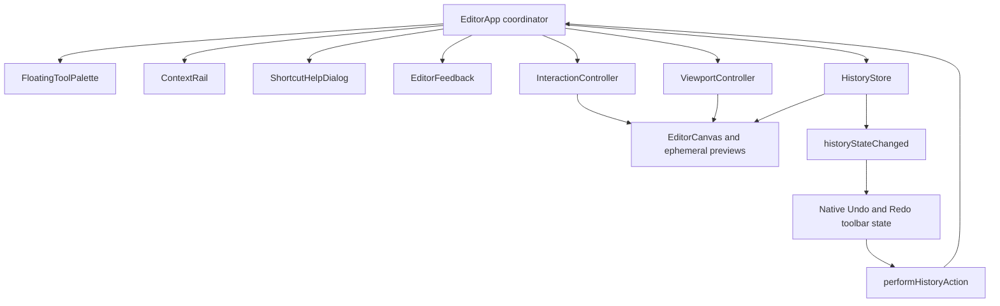

# MyShottr Editor UX Polish Design

- Date: 2026-07-31
- Status: Approved for implementation
- Target: MyShottr `v0.1.0` editor polish
- Visual direction: Canvas First + Context Rail
- Product references:
  - [Shottr Start Guide](https://shottr.cc/kb/startguide)
  - [Shottr Precision Tools](https://shottr.cc/kb/precision)
  - [Shottr Release Notes](https://shottr.cc/newversion.html)
  - [Excalidraw](https://excalidraw.com/)
  - [Excalidraw source](https://github.com/excalidraw/excalidraw)

## 1. Purpose and Authority

This document defines the interaction, layout, feedback, and implementation
boundaries for the final MyShottr v1 editor-polish pass.

It extends:

- [`2026-07-29-myshottr-v1-design.md`](./2026-07-29-myshottr-v1-design.md)
- [`2026-07-30-myshottr-v1-public-release-design.md`](./2026-07-30-myshottr-v1-public-release-design.md)

The earlier documents remain authoritative for capture, persistence, release,
and future full-page/mockup boundaries. This document takes precedence where
their editor layout, shortcut, direct-manipulation, output-feedback, or
undo/redo details differ.

The redesign borrows proven interaction patterns from Shottr and Excalidraw
without embedding either product or copying their implementation. MyShottr
keeps its own cream-and-coral visual language, bounded screenshot canvas,
native macOS output commands, and local-only document model.

## 2. Outcome

The editor should feel immediate from the first pointer-down:

1. Every drawing gesture is visible while it is happening.
2. Direct tool shortcuts work consistently with a Korean or English input
   source.
3. Selection, movement, duplication, constrained drawing, pan, and zoom behave
   like a focused drawing tool rather than a form-driven image editor.
4. The active tool and editable properties are always understandable without
   opening dropdowns.
5. Copy, save, and export report the correct terminal state; they never show a
   success state before the native operation succeeds.
6. Recovery dialogs and recovery-document flows remain removed. A capture opens
   directly into the editor.

## 3. Scope

### 3.1 In scope

- centered, compact drawing-tool palette;
- visible single-key hints on every drawing tool;
- left contextual style/action rail;
- native Copy, Save, Export, Undo, and Redo toolbar actions;
- direct tool, edit, selection, and viewport shortcuts;
- continuous creation, move, duplicate, marquee, and constraint previews;
- pointer-centered zoom and Space-drag pan;
- explicit save/export progress and completion feedback;
- Copy success hiding the editor window;
- keyboard, focus, screen-reader labeling, and reduced-motion behavior for
  editor controls;
- strict TypeScript/Swift bridge messages for history and output status;
- tests for interaction state, bridge state, native toolbar state, and visual
  layouts.

### 3.2 Not in scope

- custom colors or an eyedropper;
- custom stroke widths, text sizes, roughness, or opacity values;
- font family or font weight selection;
- grouping, alignment, distribution, or a layers panel;
- annotation history browser or screenshot library;
- autosave or recovery documents;
- OCR;
- full-page or scrolling capture;
- element capture;
- Safari or Firefox support;
- desktop, browser, device, or social-card mockups;
- full screen-reader traversal and editing of individual Konva scene nodes.

The existing capture-source and presentation boundaries remain unchanged so
future full-page capture and mockups can be added without rewriting this
editor interaction model.

## 4. Visual System and Workspace Layout

### 4.1 Native toolbar

The macOS `NSToolbar` owns system/output actions. Its default order is:

```text
Copy Image · Undo · Redo · flexible space · Save Project · Export PNG
```

The toolbar uses native icons plus labels in its current `iconAndLabel` mode.
Tooltips contain the action and shortcut:

- Copy Image — `Command-Shift-C`
- Undo — `Command-Z`
- Redo — `Command-Shift-Z`
- Save Project — `Command-S`
- Export PNG — `Command-E`

Undo and Redo are initially disabled and update from the web editor's current
history state. Copy, Save, and Export are disabled until the editor has
finished loading. While one output operation is running, Copy, Save, and
Export are disabled together; editing remains available.

Keyboard Undo/Redo inside the `WKWebView` remains owned by the web editor.
Native toolbar clicks send one bridge command to the editor. MyShottr must not
register a second native keyboard handler that can execute the same keystroke
twice.

### 4.2 Workspace

The web editor is a measured workspace rather than an image-sized stage. The
drawing-tool palette is centered above the stage, the Context Rail occupies
the left workspace column only when needed, and zoom controls remain anchored
at the lower-right safe edge. The source image is transformed inside the
remaining measured stage area.

The full web-content rectangle is the Konva stage viewport. The source image
and annotation scene share a transform group inside it. A `ResizeObserver`
provides the available workspace dimensions to one `ViewportController`.

This replaces the current model in which the stage size equals
`sourcePixelWidth * zoom`. Keeping the image-sized stage would make rail
reflow, pointer-centered zoom, and fit calculations disagree.

### 4.3 Floating tool palette

`FloatingToolPalette` is centered 16 points below the web-content top edge. It
contains tools only:

| Tool | Shortcut | Cursor |
| --- | --- | --- |
| Selection | `V` | default |
| Rectangle | `R` | crosshair |
| Arrow | `A` | crosshair |
| Line | `L` | crosshair |
| Text | `T` | text |
| Freehand | `P` | crosshair |
| Highlighter | `H` | crosshair |
| Blur | `B` | crosshair |
| Redaction | `X` | crosshair |
| Number marker | `N` | crosshair |

Each button contains:

- the existing tool icon;
- an always-visible uppercase `<kbd>` hint;
- `aria-pressed` for its active state;
- a tooltip shown on both hover and keyboard focus;
- an accessible name such as `Rectangle, shortcut R`.

The active tool uses the existing coral fill and white foreground. Hover and
focus states must remain visually distinct from the active state.

A drawing tool remains active after an element is created. `V` or the
no-active-gesture form of `Escape` returns to Selection.

### 4.4 Context Rail

`ContextStylePalette` is replaced by `ContextRail`.

Desktop geometry:

- left inset: 16 points;
- top: 76 points, below the drawing-tool palette;
- width: 248 points;
- maximum height: workspace height minus 92 points;
- internal padding: 12 points;
- control gap: 12 points;
- existing panel, border, shadow, cream, ink, and coral tokens remain in use.

The rail scrolls internally when the window height cannot contain all controls.
It does not cover the source image.

#### Rail visibility and title

| Editor state | Rail behavior |
| --- | --- |
| Selection tool, no selection | Hidden |
| Drawing tool, no selection | Shows defaults with title `New <Tool>` |
| One selected element | Shows that element's actual properties |
| Multiple selected elements | Shows common properties and title `<n> selected` |
| Blur or redaction with no configurable values | Shows the `New Blur` or `New Redaction` title and its fixed property value |

Blur displays `Radius 12 px · Fixed`. Redaction displays
`Opaque black · Fixed`. These are informative values, not interactive
controls.

#### Direct controls

The rail uses no property dropdowns.

- Color: four labeled swatch buttons.
- Rectangle fill: None plus the same four swatches.
- Stroke width: segmented 2, 4, and 8 controls with visible line samples.
- Roughness: segmented Clean, Sketch, and Rough controls for values 0, 1,
  and 2.
- Text size: segmented 16, 24, and 36 controls.
- Opacity: a discrete slider at 25%, 50%, 75%, and 100%.
- Highlighter opacity: the same slider constrained to 25% and 50%.

Each field is a labeled `fieldset`, radio group, or properly labeled slider.
Color is never the only indication of the selected value.

#### Properties by tool

| Tool or selected type | Editable properties |
| --- | --- |
| Rectangle | stroke color, fill, stroke width, roughness, opacity |
| Arrow | color, stroke width, roughness, opacity |
| Line | color, stroke width, roughness, opacity |
| Text | color, text size, opacity |
| Freehand | color, stroke width, opacity |
| Highlighter | color, opacity |
| Blur | none |
| Redaction | none |
| Number marker | color, opacity |

#### Multiple selection

For multiple selection, "common property" means the intersection of properties
supported by every selected element. The control offers only the intersection
of values valid for every selected element.

Examples:

- Rectangle + Arrow: color, stroke width, roughness, and opacity.
- Rectangle + Text: color and opacity.
- Text + Highlighter: color and opacity, with opacity limited to 25% and 50%.
- Rectangle + Blur: no common style fields.
- Multiple rectangles: color, fill, stroke width, roughness, and opacity.

If a common property has different values, the rail shows an explicit `Mixed`
label and no option appears selected. The state must not be inferred from only
the first selected element. Choosing a value applies it to every selected
element in one `updateMany` command.

The current union behavior—showing a property when only one selected type
supports it—is removed.

Segmented controls and swatches commit once per activation. Dragging a
selected-element opacity slider updates an ephemeral preview and commits one
`updateMany` when the gesture ends; cancellation restores the prior values.
Dragging a creation-default slider publishes the new preference only when the
gesture ends.

#### Selection actions

The bottom of the rail shows these actions only when selection exists:

- Bring Forward
- Send Backward
- Duplicate
- Delete

Actions have icon and text tooltips, accessible names, and disabled states.
Duplicate selects the new copies.

Canvas and export rendering both follow the document's global `zIndex` order.
The current type-band ordering of Blur, Highlighter, and other elements is
removed so Bring Forward and Send Backward always match the visible result.

### 4.5 Rail reflow

Opening or closing the rail does not change zoom.

The viewport controller:

1. records the source-space point under the center of the previous available
   canvas rectangle;
2. measures the new available rectangle;
3. adjusts pan so that source-space point appears at the new rectangle center;
4. animates only that pan adjustment for 160 ms.

With `prefers-reduced-motion: reduce`, the pan adjustment is immediate.

The top palette and zoom controls are safe-area inputs to Fit Image and Fit
Selection calculations. The source image must never be fitted underneath
those controls.

## 5. Canonical State and Component Boundaries

### 5.1 State ownership

The editor has three state categories.

#### Persisted document state

- source dimensions;
- annotation elements;
- presentation;
- creation defaults.

`EditorDocument` is the only canonical document value. The current separate
`defaults` ref and merged React document are removed.

Creation defaults are persisted but are not part of Undo/Redo. Changing a
default affects the next element and future sessions; undoing an annotation
does not roll back the most recently chosen default.

`HistoryStore` therefore stores element-scene snapshots for Undo/Redo while
keeping the latest defaults on the canonical current document.

Document defaults are authoritative for the open document. Native
`EditorPreferences` are a separate last-used seed for future new documents,
not a second mutable copy used to render the current document.

Changing a creation default intentionally updates both the current document
and the native last-used seed immediately. It does not alter another already
open document. For example, changing `New Rectangle` fill to yellow and closing
the clean current window without saving leaves that project unchanged, while
the next capture starts with yellow rectangle fill. This is the v1
"remembered last-used defaults" behavior.

Rectangle fill becomes
`EditorDefaults.rectangleFillColor: PaletteColor | null`. This removes the
separate per-window `rectangleFillColor` state and makes every visible
`New Rectangle` value saveable and reusable.

Highlighter opacity becomes
`EditorDefaults.highlighterOpacity: 0.25 | 0.5`. Other tools continue to use
`EditorDefaults.opacity`. This prevents a 75% or 100% shared opacity value from
appearing as an unset Highlighter control and prevents switching to
Highlighter from changing another tool's opacity.

This requires:

- editor-document schema version `3`;
- migration of schema versions `1` and `2` to
  `rectangleFillColor: null` and `highlighterOpacity: 0.5`;
- the web `EditorDocument` type, strict schema parser, and legacy parser;
- the native document migrator;
- native `annotationSnapshot` exact-key validation;
- native package/open/save document validation;
- `NewProjectFactory` schema-3 output;
- both fields in the strict preference bridge payload;
- both fields in native `EditorPreferences`;
- a new native preferences storage key rather than decoding the v1 shape as
  the new shape;
- fixtures and tests that assert exact schema versions and defaults keys.

If `editorPreferences.v2` is absent and valid `editorPreferences.v1` data
exists, native preferences migrate its existing tool, color, stroke width,
text size, roughness, and opacity, add `rectangleFillColor: null` and
`highlighterOpacity: 0.5`, validate the complete v2 value, then store it under
the v2 key. Invalid v1 data uses the already approved defaults.

Document schema migration is explicit and deterministic. Unknown newer schema
versions remain rejected.

Changing creation defaults updates the canonical in-memory document and global
editor preferences but does not create a scene Undo entry or mark the project
modified by itself. A later annotation snapshot includes the current defaults.
Closing an otherwise clean document after only changing creation defaults does
not show a save prompt.

#### Ephemeral interaction state

- active tool;
- selected IDs;
- text-editing ID and draft text;
- active pointer gesture and preview elements;
- marquee bounds;
- Space-pan state;
- zoom and pan;
- open shortcut-help dialog;
- transient save/export feedback.

Selection has one canonical `selectedIds` value. `SelectionController` becomes
pure selection operations and hit-test helpers; it does not mirror selection
inside a second mutable store.

Zoom, pan, selection, text draft, and transient feedback are never saved in a
`.myshottr` package.

#### Native window state

- editor readiness;
- Undo/Redo enablement received from the editor;
- output-operation in-flight state;
- project URL;
- document-modified state;
- native error presentation;
- editor-window visibility.

### 5.2 Components



- `EditorApp` coordinates state and bridge messages. It does not implement
  pointer geometry.
- `FloatingToolPalette` owns tool display only.
- `ContextRail` renders a derived view model and emits semantic property/action
  intents. It owns no copied selection values.
- `ShortcutHelpDialog` owns dialog focus and display only.
- `InteractionController` owns gesture start/update/commit/cancel semantics.
- `ViewportController` owns stage measurement, pan, zoom, fit, and coordinate
  conversion.
- `HistoryStore` owns scene mutations, transactions, and Undo/Redo availability.
- `EditorFeedback` owns delayed progress and transient status rendering.
- `EditorCanvas` renders the current committed document plus ephemeral previews.

## 6. Keyboard Contract

### 6.1 Normalization and suppression

Shortcut ownership is:

| Owner | Shortcuts |
| --- | --- |
| Native command/menu path | `Command-Shift-C`, `Command-S`, `Command-E` |
| Web editor | tools, element editing, Undo/Redo, selection, and viewport shortcuts in sections 6.2–6.4 |

The web key router never intercepts or calls `preventDefault` for a
native-owned output shortcut. Native-owned shortcuts remain available while
inline text editing or shortcut help has focus whenever their toolbar action
is enabled.

Tool and view shortcuts use `KeyboardEvent.code`, not the printable
`KeyboardEvent.key`. This keeps `R`, `T`, `Shift+1`, `Shift+2`, and `?`
consistent across Korean and English input sources.

Global editor shortcuts are ignored when:

- `event.isComposing` is true;
- focus is in an input, textarea, select, or `contenteditable` element;
- the inline text editor owns the event;
- the shortcut-help dialog owns the event.

During an active pointer gesture, only Escape is routed as a global editor
shortcut. Other tool, edit, and viewport shortcuts wait until that gesture
terminates.

While inline text editing is active, standard text editing Copy/Paste behavior
wins over element Copy/Paste.

`Command-Y` is not an additional Redo shortcut in this design.

### 6.2 Tool shortcuts

| Shortcut | Action |
| --- | --- |
| `V` | Selection |
| `R` | Rectangle |
| `A` | Arrow |
| `L` | Line |
| `T` | Text |
| `P` | Freehand |
| `H` | Highlighter |
| `B` | Blur |
| `X` | Redaction |
| `N` | Number marker |

### 6.3 Edit and selection shortcuts

| Shortcut | Action |
| --- | --- |
| `Command-Z` | Undo |
| `Command-Shift-Z` | Redo |
| `Command-D` | Duplicate selected elements and select the copies |
| `Command-C` | Copy selected editable elements |
| `Command-V` | Paste editable elements and select the copies |
| `Command-Shift-C` | Copy the flattened PNG through the native command |
| `Delete` or `Backspace` | Delete selected elements |
| Arrow keys | Move selection by 1 source pixel |
| `Shift` + Arrow keys | Move selection by 10 source pixels |
| `Option` + Drag | Duplicate and drag copies |
| `Shift` + Click | Toggle one element in the selection |
| `Enter` | Edit the single selected text element |
| `Escape` | Apply the priority rules below |
| `?` | Open shortcut help |

Nudge distances are source pixels and do not change with zoom. Movement remains
clamped so elements cannot be moved completely outside the source bounds.
Auto-repeat from one held arrow key is one history transaction from key-down
until key-up.

### 6.4 View shortcuts

| Shortcut | Action |
| --- | --- |
| `Space` + Drag | Pan |
| Mouse wheel or two-finger scroll | Pan |
| Pinch or `Command` + Wheel | Zoom around the pointer |
| `Command-0` | 100% |
| `Shift-1` | Fit Image |
| `Shift-2` | Fit Selection |

`Shift-1` and `Shift-2` are detected from `Digit1` and `Digit2`. `?` is
detected from `Slash` with Shift.

Fit Selection is enabled only when at least one element is selected. If no
selection exists, it does nothing and does not change history or viewport.

### 6.5 Escape priority

Only the first applicable rule runs:

1. If shortcut help is open, close it and restore prior focus.
2. If inline text editing is active, cancel the draft and keep the original
   text unchanged.
3. If a pointer interaction is active, cancel it and discard its preview.
4. Otherwise, if a drawing tool is active, switch to Selection.
5. Otherwise, clear the current selection.

Cancelling a gesture does not add a history entry and does not publish
`documentChanged`.

## 7. Direct-Manipulation Contract

### 7.1 Pointer lifecycle

Canvas interactions use pointer events consistently.

- `pointerdown` establishes one active gesture and calls
  `setPointerCapture`.
- `pointermove` updates ephemeral geometry only.
- `pointerup` commits one semantic document command and releases capture.
- `pointercancel` and `Escape` discard the preview and restore any transformed
  Konva nodes.

Window-level mouse events are not a second competing terminal path.

At gesture start, the controller snapshots:

- active tool;
- the current creation-defaults object, including `rectangleFillColor` and
  `highlighterOpacity`;
- modifier keys;
- selected elements;
- source-space starting point.

Changing tools or defaults while a pointer is held cannot change the element
that is being previewed or committed.

### 7.2 Creation preview

Rectangle, Arrow, Line, Freehand, Highlighter, Blur, and Redaction render from
pointer-down through pointer-up.

Number marker renders a live marker at the pointer and commits on click.

Text behaves as follows:

1. Press `T`.
2. Click a source position.
3. Open the inline text editor immediately at that point.
4. Commit one text element when non-empty text is confirmed.
5. Cancel without creating an element when `Escape` is pressed or the final
   text is empty.

Double-clicking an existing text element, or pressing Enter with exactly one
text element selected, opens the same inline editor. Other selections ignore
Enter. Return inserts a line break, Command-Enter or focus leaving the editor
commits, and Escape restores the pre-edit value. Committing an empty existing
text value deletes that element in one history entry.

Pointer movement never dispatches a history command or native
`documentChanged`. Preview rendering is limited to one update per animation
frame. Pointer-up commits exactly one command and one Undo entry.

### 7.3 Constraints

- Rectangle + Shift: width and height use the larger signed axis magnitude to
  produce a square in the drag direction.
- Arrow or Line + Shift: the endpoint snaps to the nearest 45-degree angle from
  the start point while preserving radial distance.
- Constraint geometry is computed in source space and is identical for preview
  and commit.

Shift is no longer a pan modifier. All existing Shift-pan behavior and tests
are replaced by Space-pan behavior.

### 7.4 Marquee selection

With Selection active, dragging empty canvas shows an immediate translucent
marquee.

- A normal marquee replaces the selection.
- An element is included when its source-space axis-aligned bounding box after
  rotation intersects the marquee. Intersection is used so thin lines and
  arrows can be selected reliably.
- A drag shorter than 3 CSS points on both axes is a click and clears
  selection.
- The marquee is ephemeral and never enters document history.

### 7.5 Move, resize, rotate, and duplicate

Move preview uses draft element geometry or Konva node transforms; it does not
mutate the canonical document on every pointer movement.

Pointer-up commits one `updateMany` transaction. Pointer cancellation restores
the original nodes and document without history changes.

Resize and rotate follow the same terminal rule.

Option-drag:

1. snapshots selected source elements;
2. previews cloned elements while originals remain in place;
3. commits one `createMany` on pointer-up;
4. selects the new IDs;
5. discards all clones on cancellation.

`Command-D` uses the same duplication primitive and selection result.

## 8. Viewport Contract

`ViewportController` is the sole owner of zoom and pan mutations.

### 8.1 Zoom range

- minimum: 10%;
- maximum: 800%;
- zoom buttons change by 10 percentage points within that range;
- the visible percentage is rounded for display, not for internal geometry.

### 8.2 Pointer-centered zoom

Before zooming, the controller records the source-space point under the
pointer. It calculates the new pan so the same source point remains under the
same workspace coordinate after zoom.

Pinch-generated wheel events and `Command` + wheel share this exact path.
Browser/WKWebView page zoom is prevented while the editor handles the gesture.

### 8.3 Pan bounds

When an image axis is smaller than the available workspace axis, it is centered
on that axis and cannot be panned.

When an image axis is larger than its available axis, pan is clamped between
`availableMaximum - transformedImageSize` and `availableMinimum`. This prevents
empty workspace from appearing beyond either source-image edge.

Space changes the cursor to `grab`; active Space-drag uses `grabbing`. Releasing
Space or terminating the pointer gesture restores the active tool cursor.
Space must be held before pointer-down to start pan. Pressing Space after a
creation, move, resize, rotate, or duplicate gesture has started does not
change that gesture's meaning.

### 8.4 Fit commands

- 100% sets zoom to `1` and centers the source image in the current available
  rectangle.
- Fit Image selects the largest zoom that contains the entire source image
  inside the safe canvas rectangle with 24 points of padding.
- Fit Selection selects the largest zoom that contains the selected bounds
  inside the safe canvas rectangle with 24 points of padding.
- Fit commands do not affect document history.

## 9. Shortcut Help

Pressing `?` opens `ShortcutHelpDialog`. It groups:

- Tools;
- Edit and Selection;
- View and Navigation;
- Output.

The dialog:

- uses `role="dialog"` and `aria-modal="true"`;
- moves focus to its close button;
- traps Tab and Shift-Tab;
- closes with Escape;
- restores focus to the previously focused control;
- displays the same shortcut registry used by the palette and key router.

Shortcut labels must not be copied into separate hard-coded registries that can
drift.

## 10. Output Feedback and Window Behavior

### 10.1 Shared output guard

Only one Copy, Save, or Export operation can run per document window at a time.
The native controller owns this guard and toolbar enablement.

Editor changes remain available during Save and Export. The save revision
contract therefore distinguishes a fully saved document from a save that
completed while newer edits were made.

### 10.2 Copy Image

The exact success sequence is:

1. request the composited PNG from the editor;
2. validate and assemble the transfer;
3. write the PNG to the macOS clipboard;
4. call `window.orderOut(nil)`.

The window is hidden, not closed. Its document and Undo history remain alive.

If any step fails, the window remains visible and the existing native actionable
error UI is shown. No success toast is needed because successful Copy hides the
window.

### 10.3 Save Project

For an unsaved project, the save destination is selected before requesting a
snapshot or publishing a started state. Cancelling the save panel is silent.

After a destination exists:

1. `DocumentWindowController` captures `session.modificationRevision`;
2. native sends Save `started`;
3. native requests the annotation snapshot;
4. native writes the project atomically;
5. `DocumentWindowController` passes the captured revision to
   `session.completeSave`;
6. native sends one terminal state.

Terminal UI:

| Native result | Editor feedback |
| --- | --- |
| fully saved | `Saved` for 1.5 seconds |
| saved snapshot but newer edits remain | `New changes still need saving` for 2 seconds |
| task cancelled after start | clear progress silently |
| failed | clear progress; native alert owns the error |

An explicit Save command never hides or closes the window. If Save was chosen
inside the existing "save changes before closing" flow, a fully completed save
continues that already-requested close. A superseded, cancelled, or failed save
does not close it.

### 10.4 Export PNG

The export destination is selected before the operation starts. Cancelling the
panel is silent.

After a destination exists:

1. native sends Export `started`;
2. native requests and writes the composited PNG;
3. native sends Export `completed` with a display-safe basename.

The success message is `Exported <filename>` for 1.5 seconds. It never includes
the parent path. Control characters and line breaks are removed, and the
display name is limited to 120 user-perceived characters.

Export keeps the window visible. Failure clears progress and uses the native
error UI.

### 10.5 Progress timing

`EditorFeedback` is centered 24 points above the lower workspace edge and does
not overlap the lower-right zoom controls. It starts a 150 ms timer on Save or
Export `started`.

- If a terminal state arrives before the timer, no progress indicator flashes.
- Otherwise show `Saving…` or `Exporting…`.
- A terminal state always clears the timer and progress state.
- Feedback uses `role="status"` and `aria-live="polite"`.
- A status whose operation request ID is no longer current cannot replace a
  newer operation's progress or toast.

## 11. Bridge Contract

The bundled native app and web editor continue to use bridge protocol version
`1`. This change is additive and both sides must ship together.

The existing envelope remains:

```json
{
  "protocolVersion": 1,
  "requestId": "UUID",
  "type": "messageType",
  "payload": {}
}
```

Strict keys and the existing 8 MiB payload limit remain unchanged.

### 11.1 History state: Editor to Native

```json
{
  "protocolVersion": 1,
  "requestId": "UUID",
  "type": "historyStateChanged",
  "payload": {
    "canUndo": true,
    "canRedo": false
  }
}
```

`HistoryStore` exposes read-only `canUndo` and `canRedo`.

During an active scene transaction both store values are `false`, because
calling Undo or Redo during a transaction is invalid. `EditorApp` additionally
reports both values as `false` while a pointer gesture, held-key nudge, inline
text edit, selected-element slider gesture, or Shortcut Help dialog is active.
A received history command checks the same interaction lock and becomes a
no-op if the lock is active.

The editor publishes history state:

- immediately after document load;
- after begin, commit, or cancel transaction;
- after a document command;
- after Undo or Redo;
- whenever the interaction lock enters or leaves one of the states listed
  above.

Duplicate identical state may be suppressed.

### 11.2 History action: Native to Editor

```json
{
  "protocolVersion": 1,
  "requestId": "UUID",
  "type": "performHistoryAction",
  "payload": {
    "action": "undo"
  }
}
```

`action` is exactly `undo` or `redo`.

Native toolbar clicks and web keyboard shortcuts call one shared editor
function. A successful history action:

1. updates the canonical document;
2. clears selection;
3. sends `documentChanged`;
4. publishes the next history state.

A disabled/no-op action sends no `documentChanged` and still publishes the
correct history state.

### 11.3 Operation status: Native to Editor

All states for one operation reuse the same envelope `requestId`.

Allowed strict payload variants are:

```ts
type OperationStatus =
  | {
      operation: "save" | "export";
      phase: "started";
    }
  | {
      operation: "save";
      phase: "completed";
    }
  | {
      operation: "save";
      phase: "superseded";
    }
  | {
      operation: "export";
      phase: "completed";
      displayName: string;
    }
  | {
      operation: "save" | "export";
      phase: "cancelled" | "failed";
    };
```

`displayName` is required only for completed Export and forbidden in every
other variant. Raw error messages and paths never cross this status message.
Native error presentation remains the sole owner of failure copy.

The currently declared `saveCompleted` and `saveFailed` message types are not
used for this state machine.

### 11.4 Fire-and-forget failures

`historyStateChanged`, `performHistoryAction`, and `operationStatus` are
uncorrelated state/command messages. A JavaScript-evaluation failure while
sending one must call the existing bridge-failure path; it must not disappear
only because there is no pending correlated request.

The existing owner-routed request completion, request deadlines, retired
request IDs, malformed-message rejection, snapshot request, and composite
transfer contracts remain unchanged.

## 12. History and Performance Invariants

- Creation pointer movement never calls `HistoryStore.dispatch`.
- Move pointer movement never calls `HistoryStore.dispatch`.
- Marquee and viewport movement never call `HistoryStore.dispatch`.
- Pointer-up commits at most one semantic command.
- Pointer cancellation commits no command.
- Property changes for multiple selection use one `updateMany`.
- One drag, resize, rotate, duplicate-drag, or held-arrow nudge is one Undo
  entry.
- Defaults change independently of scene Undo/Redo.
- No pointer move sends `documentChanged`.
- Preview updates are animation-frame bounded.
- Canvas rendering and PNG export use the same global z-order.

## 13. Accessibility

Required for this pass:

- visible focus rings on every interactive control;
- logical Tab order: tool palette, Context Rail, zoom controls;
- `aria-pressed` or radio semantics for selectable controls;
- accessible color names in addition to visible swatches;
- `Mixed` expressed in visible text and accessibility state;
- tooltips available on hover and focus;
- no duplicate screen-reader announcement of visible `<kbd>` hints;
- dialog focus trap and focus restoration;
- polite live-region output feedback;
- text contrast of at least 4.5:1;
- control-boundary and active-state contrast of at least 3:1;
- reduced-motion handling for rail reflow and feedback transitions.

The Konva scene remains a visual canvas in v1. Keyboard users can operate the
tool palette, selected-element actions, nudge, delete, duplicate, Undo/Redo,
pan/zoom shortcuts, and text editing. A separate DOM element tree for
screen-reader traversal of every annotation is not part of this pass.

## 14. Testing and Acceptance

### 14.1 Unit tests

#### Shortcut router

- V/R/A/L/T/P/H/B/X/N mappings;
- Korean/English input-source behavior through `KeyboardEvent.code`;
- text input, contenteditable, composing, and dialog suppression;
- active-gesture suppression except Escape;
- Escape priority;
- `Digit1`, `Digit2`, and `Slash` normalization;
- no `Command-Y` alias.

#### History

- initial `canUndo=false`, `canRedo=false`;
- dispatch, Undo, Redo, and new-command state transitions;
- `canUndo=false`, `canRedo=false` during a transaction;
- commit and cancel availability restoration;
- pointer, nudge, text-edit, and slider interaction locks;
- defaults stay current across element Undo/Redo;
- one held nudge produces one entry.

#### Interaction

- rectangle, arrow, line, freehand, highlighter, blur, and redaction previews do
  not mutate the document;
- preview and commit use the tool/default snapshot from pointer-down;
- square and 45-degree constraints;
- marquee intersection selection;
- Shift-click toggle;
- Option-drag and Command-D use one duplication primitive;
- pointercancel and Escape restore nodes and history;
- pointer-up emits one command.

#### Viewport

- pointer source coordinate remains stable through zoom;
- Space-pan replaces Shift-pan;
- rail reflow keeps zoom and centered source point;
- pan bounds;
- 100%, Fit Image, and Fit Selection;
- safe-area calculations.

#### Context Rail

- hidden, new-tool defaults, single-selection, and multi-selection states;
- property intersection;
- mixed state for color, fill, width, roughness, text size, and opacity;
- fixed Blur and Redaction display;
- one `updateMany` per property action;
- one selected-element slider commit per gesture;
- duplicate, delete, and z-order actions;
- control semantics and labels.

### 14.2 React integration tests

- initial history state is sent after load;
- native and keyboard history actions share behavior;
- tool shortcuts are ignored while editing text;
- a new text click opens the inline editor before commit;
- save/export progress appears only after 150 ms;
- fast completion does not flash progress;
- save completed, superseded, cancelled, and failed states never overlap;
- stale request IDs cannot replace current feedback;
- completed Export shows only the sanitized basename.

### 14.3 Swift tests

- strict payload validation for every new bridge variant;
- unknown keys, invalid phases, and invalid operation/displayName combinations
  are rejected;
- initial Undo/Redo toolbar state;
- `historyStateChanged` updates toolbar enablement;
- toolbar Undo/Redo sends exactly one `performHistoryAction`;
- active transaction history state disables both actions;
- unsaved Save panel cancellation occurs before snapshot/status;
- save success keeps the window and publishes completed;
- save with newer edits publishes superseded and remains modified;
- save/export failure publishes failed before native error presentation;
- export completion sends a sanitized basename;
- Copy hides only after both composite and clipboard success;
- Copy failure keeps the window visible;
- output commands are guarded against overlap;
- fire-and-forget JavaScript failures reach the bridge-failure callback.

Narrow protocol/closure injection is permitted for composite creation,
clipboard writing, save/export destinations, status sending, and window hiding
so these behaviors can be tested without a real pasteboard or modal panel.

### 14.4 Visual regression states

Capture at a fixed document, window size, and appearance:

1. Selection tool with no selection and no rail.
2. Rectangle tool with `New Rectangle` rail.
3. Selected rectangle with property rail and actions.
4. Mixed rectangle/text selection.
5. Shortcut Help dialog.
6. Save success feedback.
7. Reduced-motion rail state.

Validate both light and dark macOS appearance through the existing
`setAppearance` bridge message.

### 14.5 Required verification commands

The completed work must run:

```bash
pnpm --filter @myshottr/editor test
pnpm --filter @myshottr/editor typecheck
pnpm --filter @myshottr/editor build
xcodegen generate
xcodebuild test \
  -project MyShottr.xcodeproj \
  -scheme MyShottr \
  -destination "platform=macOS" \
  CODE_SIGNING_ALLOWED=NO
xcodebuild build \
  -project MyShottr.xcodeproj \
  -scheme MyShottr \
  -configuration Debug \
  -destination "platform=macOS"
```

After targeted checks pass and every running MyShottr process has been closed
without losing user work, run the repository-wide gate:

```bash
Scripts/verify-v1.sh
```

The implementation also requires a visual comparison against the approved
Context Rail reference at the same window size and editor state.

## 15. Completion Criteria

This design is complete when:

1. every approved shortcut and interaction has one unambiguous owner;
2. pointer movement is visibly immediate and does not mutate persisted state;
3. Context Rail values always derive from the canonical document/selection;
4. native Undo/Redo state cannot diverge from editor history;
5. Copy hides only after clipboard success;
6. Save and Export distinguish cancellation, failure, full success, and
   save-with-newer-edits;
7. the recovery flow remains absent;
8. the full automated and visual acceptance set passes;
9. existing native capture, Chrome viewport capture, editable project, and
   future presentation boundaries remain intact.
